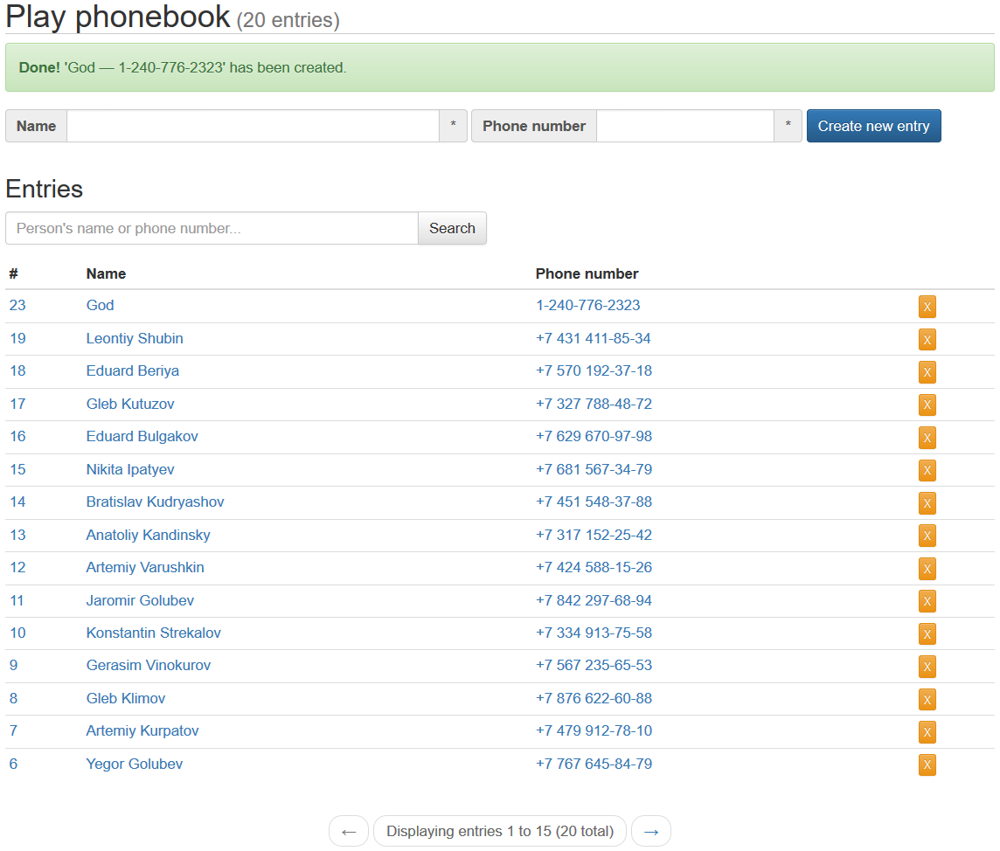

# Play Phonebook example #

This is a learning project for a Scala Play framework, a simple phonebook with CRUD operations using 'table module' design, forms validation, working CSRF setup and Slick-based DB with migrations.

It looks like this:

Below is a short design document which I used as a guide, and a bit of afterthoughts.

## Design outline ##
#### Phonebook structure ####
  * Phonebook consists of phonebook entries, which is a combination of a name and a phone number, e.g. `John Doe — +1 202 555-0167`.
  * Name and phone number are strings limited by 1024 symbols. Any symbol is allowed in a name, while in a phone number letters are forbidden.
  * Duplicate entries (same name and phone number) are forbidden.
#### User  ####
  * Entries are shown on a `/entries` page as a sequence sorted from oldest to newest, with pagination.
  * Entries can be added on `/enties/new`, edited on `/entries/:id` and removed on `/entries/:id/delete` pages.
  * From the `/entries` page, it is possible to search entries by name or phone number.
#### UI ####
  * Errors and notifications should be presented on the 'main' `/entries` page in some sensible manner, like Bootstrap alerts.
  * UI does not matter much; it should use Twitter Bootstrap and be at least somewhat pleasant to look at.

#### Tech stuff ####  
  * Application should be localizable.
  * Entries are stored in in-memory H2 database.
  * Database schema should be created using migrations and populated with a few random entries when app is started.
  * No sync handlers, everything is async.
  
## What I learned ##
Play is a great framework; scalable and idiomatic, lots of features, documentation is very good, community is large and helpful.

However, its feature-completeness and robustness comes with a cost: Play looks and feels like ASP.NET of Scala. Certain amount of ceremony should be expected, and 'simple' things can become a source of big headache.
Template syntax errors can be really obscure. 
A big con is the constant breaking changes introduced with every version. Any tutorial or example you can find is guaranteed to be deprecated.

Overall, Play is definitely more idiomatic and type-safe than Scalatra, but for a next project I would rather try Akka HTTP.